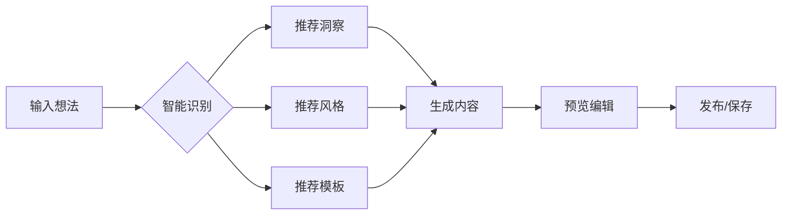

# 🚀 智能创作中心使用指南

## 📋 功能概述

智能创作中心是内容工厂的全新创作入口,采用**极简设计**和**智能推荐**理念,让内容创作变得更加简单高效。

### 🎯 核心特性

1. **零门槛输入** - 一个输入框解决80%需求
2. **智能建议** - AI理解用户意图,主动提供帮助
3. **灵活路径** - 多种创作入口,不强制流程
4. **渐进引导** - 复杂功能逐步展开,不overwhelm用户
5. **数据驱动** - 洞察卡片让数据触手可及
6. **草稿管理** - 随时保存,随时继续

---

## 🎨 界面布局

```
┌─────────────────────────────────────────────┐
│            AI创作中心 (新主界面)              │
├─────────────────────────────────────────────┤
│                                             │
│ 🎯 快速创作输入框                          │
│ ┌───────────────────────────────────────┐   │
│ │ "我想写..." 💡智能建议自动弹出        │   │
│ └───────────────────────────────────────┘   │
│                                             │
│ 📊 热门洞察卡片 (横向滑动)                 │
│ ┌─────┐ ┌─────┐ ┌─────┐ ┌─────┐          │
│ │咖啡 │ │美食 │ │职场 │ │旅行 │          │
│ │5条洞察│ │8条洞察│ │3条洞察│ │12条洞察│       │
│ └─────┘ └─────┘ └─────┘ └─────┘          │
│                                             │
│ 📝 草稿箱 (2)  │  ✨ 模板库                │
│ • 探店笔记    │  • 探店打卡               │
│ • 效率工具    │  • 好物推荐               │
│              │  • 干货分享               │
└─────────────────────────────────────────────┘
```

---

## 🚀 快速开始

### 方式1: 直接输入创作

1. 在顶部输入框输入你想写的内容
   - 例如: "咖啡探店：分享一家隐藏在小巷里的精品咖啡店"

2. 系统自动识别意图并提供智能建议
   - 🔍 咖啡相关洞察 (5条)
   - 🎨 文艺小清新风格
   - 📋 探店打卡模板

3. 点击建议或按下 `Ctrl+Enter` 立即生成内容

### 方式2: 从洞察卡片开始

1. 浏览横向滑动的洞察卡片
2. 点击感兴趣的类目(咖啡☕、美食🍜、职场💼等)
3. 自动填充相关数据和建议
4. 一键生成内容

### 方式3: 使用模板快速创作

1. 在右侧模板库浏览可用模板
2. 筛选分类: 探店、种草、知识、生活等
3. 点击模板卡片
4. 编辑并生成

### 方式4: 继续编辑草稿

1. 在左侧草稿箱查看历史草稿
2. 点击草稿卡片继续编辑
3. 支持归档和删除管理

---

## ⌨️ 快捷键

| 快捷键 | 功能 |
|--------|------|
| `Ctrl+Enter` / `Cmd+Enter` | 立即生成内容 |
| `Tab` | 选择第一个智能建议 |
| `Esc` | 关闭建议面板 |

---

## 💡 智能建议系统

### 自动识别关键词

输入包含以下关键词时,系统会自动推荐:

- **咖啡** → 咖啡相关洞察 + 文艺风格 + 探店模板
- **美食** → 美食热点分析 + 生活分享风格 + 美食推荐模板
- **职场** → 职场干货洞察 + 专业深度风格 + 干货分享模板
- **旅行** → 旅行攻略数据 + 游记风格 + 旅行vlog模板

### 智能建议类型

1. **🔍 洞察建议** (Insight)
   - 基于数据分析的内容建议
   - 包含热度趋势和数据支持

2. **🎨 风格建议** (Style)
   - 适合话题的写作风格
   - 轻松活泼 / 专业深度 / 故事化等

3. **📋 模板建议** (Template)
   - 快速开始的内容模板
   - 探店打卡 / 好物推荐 / 干货分享等

4. **💡 通用建议** (General)
   - 智能分析 / 选择模板 / 浏览洞察

---

## 📊 洞察卡片详解

### 卡片信息

每个洞察卡片包含:

- **类目图标** - 视觉识别
- **趋势标识** - 📈上升 / 📉下降 / ➡️稳定
- **洞察数量** - 可用的数据条数
- **更新时间** - 数据新鲜度
- **热门标签** - 相关话题标签

### 使用技巧

1. **横向滑动** 浏览所有类目
2. **点击卡片** 快速开始创作
3. **查看更多** 浏览完整洞察库

---

## 📝 草稿管理

### 草稿状态

- **🔵 蓝色边框** - 24小时内更新
- **🟢 绿色边框** - 3天内更新
- **⚪ 灰色边框** - 更早的草稿

### 草稿操作

- **继续编辑** - 恢复草稿继续创作
- **归档** - 保存但隐藏
- **删除** - 永久删除

### 自动保存

- 输入3秒后自动保存
- 避免内容丢失
- 可在设置中关闭

---

## ✨ 模板库

### 可用模板

1. **📍 探店打卡** - 餐厅、咖啡店等探店体验
2. **🎁 好物推荐** - 实用好物种草
3. **📚 干货分享** - 知识类实用技巧
4. **📹 生活vlog** - 日常生活记录
5. **✈️ 旅行攻略** - 详细旅行信息
6. **💄 美妆教程** - 化妆技巧分享

### 模板信息

- **适用平台** - 小红书/抖音/公众号等
- **写作风格** - 轻松活泼/专业深度等
- **使用次数** - 热门程度参考
- **用户评分** - ⭐⭐⭐⭐⭐

### 分类筛选

快速切换: 全部 / 探店 / 种草 / 知识 / 生活 / 旅行 / 美妆

---

## 🎯 创作流程

### 标准流程



### 快捷流程

```
输入 → Ctrl+Enter → 生成 → 发布
```

### 灵活流程

```
洞察卡片 → 自动填充 → 调整 → 生成
模板库 → 选择模板 → 编辑 → 生成
草稿箱 → 继续编辑 → 完善 → 生成
```

---

## 🔧 高级功能

### 自定义设置

在创作设置页面可配置:

- 默认平台(小红书/公众号)
- 默认风格(轻松/专业)
- 默认字数
- 是否包含配图
- 配图数量

### 批量创作

1. 选择多个洞察
2. 批量生成内容
3. 统一管理草稿

### 数据分析

查看创作数据:
- 创作频率
- 热门话题
- 偏好风格
- 完成率

---

## 💻 技术实现

### 前端架构

```
SmartCreationHub/
├── QuickInput.tsx         # 智能输入组件
├── InsightCards.tsx       # 洞察卡片组件
├── DraftManager.tsx       # 草稿管理组件
├── TemplateGallery.tsx    # 模板库组件
├── CreationModal.tsx      # 创作弹窗
└── index.tsx              # 主入口
```

### 状态管理

使用 Zustand 管理全局状态:

```typescript
interface CreationState {
  userInput: string;              // 用户输入
  selectedInsight: Insight | null; // 选中洞察
  selectedTemplate: Template | null; // 选中模板
  currentStep: string;            // 当前步骤
  settings: CreationSettings;     // 创作设置
  // ... 更多状态
}
```

### 关键特性

1. **防抖输入** - 300ms延迟,减少不必要的请求
2. **智能缓存** - 建议结果缓存,提升响应速度
3. **懒加载** - 组件按需加载
4. **动画优化** - 使用 Framer Motion
5. **响应式设计** - 完美适配各种屏幕

---

## 🎨 设计理念

### 用户体验原则

1. **极简主义** - 减少用户思考,降低操作成本
2. **渐进式披露** - 复杂功能逐步展开
3. **即时反馈** - 每个操作都有明确反馈
4. **容错设计** - 允许撤销和重做
5. **一致性** - 保持整体风格统一

### 视觉设计

- **配色方案** - 紫色渐变为主色调
- **圆角设计** - 柔和友好的视觉感受
- **卡片布局** - 清晰的信息层级
- **动画效果** - 自然流畅的交互
- **图标系统** - 统一的视觉语言

---

## 📱 移动端适配

### 响应式布局

- **桌面端** (>1024px) - 完整功能展示
- **平板端** (768-1024px) - 优化布局
- **移动端** (<768px) - 简化界面

### 触控优化

- 更大的点击区域
- 滑动手势支持
- 长按菜单
- 双击放大

---

## 🚀 性能优化

### 加载优化

- 首屏加载 < 1秒
- 组件懒加载
- 图片懒加载
- 代码分割

### 运行优化

- 虚拟滚动(长列表)
- React.memo 优化
- useMemo / useCallback
- 防抖和节流

---

## 🔮 未来规划

### 短期(1-2周)

- [ ] AI语音输入
- [ ] 多语言支持
- [ ] 主题切换(暗色模式)
- [ ] 快捷键自定义

### 中期(1-2月)

- [ ] 协同创作
- [ ] 版本历史
- [ ] 内容对比
- [ ] AI优化建议

### 长期(3-6月)

- [ ] 移动端App
- [ ] 浏览器插件
- [ ] API开放
- [ ] 社区分享

---

## ❓ 常见问题

### Q: 如何切换到智能创作中心?

A: 在左侧导航栏点击 "🚀 智能创作" 按钮即可。

### Q: 智能建议不准确怎么办?

A: 可以忽略建议,直接输入内容或选择其他模板。系统会学习你的偏好。

### Q: 草稿会自动保存吗?

A: 是的,输入3秒后自动保存。也可以在设置中关闭此功能。

### Q: 可以同时编辑多个草稿吗?

A: 目前不支持,但可以在草稿箱中快速切换。

### Q: 模板可以自定义吗?

A: 即将支持自定义模板功能,敬请期待。

---

## 📞 反馈与支持

如有问题或建议,欢迎反馈:

- 📧 Email: support@content-factory.com
- 💬 微信: ContentFactory
- 🐛 Bug反馈: GitHub Issues
- 💡 功能建议: 产品反馈表单

---

## 📝 更新日志

### v1.0.0 (2025-01-13)

🎉 智能创作中心正式上线!

**新增功能:**
- ✅ 智能输入框with实时建议
- ✅ 洞察卡片横向滑动
- ✅ 草稿管理系统
- ✅ 模板库with分类筛选
- ✅ 快捷键支持
- ✅ 自动保存功能
- ✅ Zustand状态管理
- ✅ 完整的动画效果

**优化改进:**
- ⚡ 极大提升创作效率
- 🎨 全新的视觉设计
- 📱 完善的响应式支持
- 🔄 更流畅的用户体验

---

## 🎉 开始使用

准备好了吗?点击左侧导航栏的 **"🚀 智能创作"** 按钮,开启你的高效创作之旅!

**提示:** 第一次使用建议先浏览洞察卡片,了解当前热门话题,然后选择一个感兴趣的类目开始创作。

---

*本文档持续更新中,最后更新时间: 2025-01-13*
